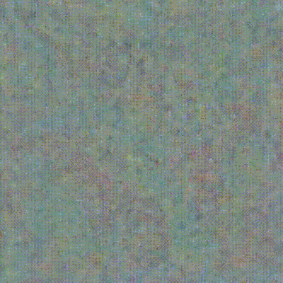

# adversarial_attack_YOLOv2

## Описание

Этот проект создан в рамках учебно-исследовательской практики НИУ ВШЭ, в нем реализуется создание и тестирование adversarial-патчей для атаки на детектор объектов YOLO v2. Главной целью данной работы является демонстрация уязвимости современных сверточных нейронных сетей перед атаками с использованием adversarial-патчей. Проект повторяется статью Fooling automated surveillance cameras: adversarial patches to attack person detection[https://arxiv.org/pdf/1904.08653]

  


## Структура проекта

Проект включает несколько ключевых частей:

- **train_patch.py**: основной скрипт для обучения adversarial-патчей. Поддерживает разные режимы (obj, cls, obj-cls) для минимизации различных целей.
- **load_data.py**: содержит модули для загрузки данных и работы с изображениями (INRIA dataset), а также для применения патчей к изображениям.
- **compare.py**: инструмент для сравнения различных методов генерации adversarial-патчей.
- **requirements.txt**: файл с зависимостями для установки всех необходимых библиотек.

## Требования

Для работы проекта требуется видеокарта **NVIDIA** с поддержкой **CUDA**.


### Установка зависимостей

1. Клонируйте репозиторий:

```bash
git clone https://github.com/adversual_attack_YOLOv2.git
cd adversual_attack_YOLOv2
```

2. Установите зависимости:
```bash
pip install -r requirements.txt
```
### Получение набора данных INRIA

Для загрузки набора данных INRIA Person выполните следующие команды:
```bash
curl ftp://ftp.inrialpes.fr/pub/lear/douze/data/INRIAPerson.tar -o inria.tar
tar xf inria.tar
mv INRIAPerson inria
cp -r yolo-labels inria/Train/pos/
```
### Запуск

Для обучения adversarial-патчей используйте команду:
```bash
python train_patch.py <obj|cls|obj-cls> [resume_path] [init_image_path]
```
где:
- <obj|cls|obj-cls>: Режим работы. Выберите между минимизацией objectness (obj), class score (cls) или комбинированным подходом (obj-cls).
- [resume_path]: (опционально) Путь к чекпоинту для продолжения обучения.
- [init_image_path]: (опционально) Путь к изображению для инициализации патча.

### Пример сравнительного анализа

Для выполнения сравнительного анализа разных методов генерации adversarial-патчей, используйте скрипт:
```bash
python compare.py --modes obj cls obj-cls --epochs 50
```
### Получение весов YOLOv2

Убедитесь, что у вас есть веса YOLOv2 MS COCO:
```bash
mkdir weights
curl https://pjreddie.com/media/files/yolov2.weights -o weights/yolo.weights
```
